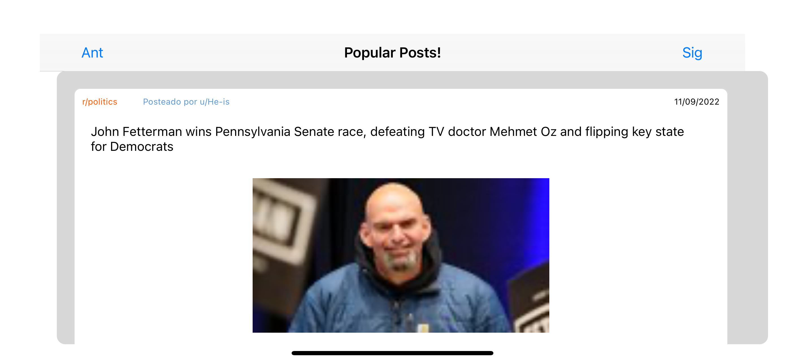

# Swift App Demo

## PopularPosts! An app to get Reddit top posts.

## Disclaimer

- This is designed for iOS 15.0 using xCode 13.1
- Cocoapods 1.11.2

## DEPENDENCIES:

- Alamofire 5.6.2
- SDWebImage 5.14.0

# Results

### Portrait View:


### Landscape View:



### App Icon:


## Features

- Auto size view
- Portrait and Landscape views are allowed
- Device language
- Pagination

## Installation

Please, consider having CocoaPods installed.

Inside workspace folder run:

```sh
pod install
```

Then, you could open PopularPosts.xcworkspace

# Pending changes:

- Gesture detection on Table Cell Views
